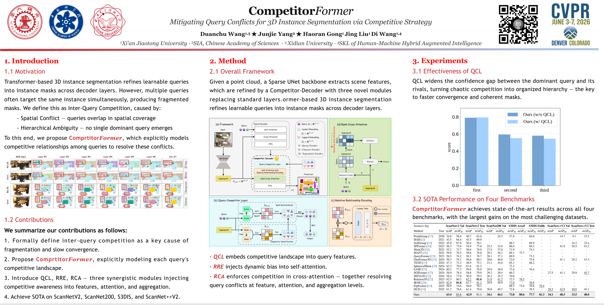

# CompetitorFormer

> **CompetitorFormer: Mitigating Query Conflicts for 3D Instance Segmentation via Competitive Strategy (CVPR 2026)**

This repository is the official implementation of CompetitorFormer, a competitive-strategy-based transformer that mitigates query conflicts for 3D instance segmentation.

<p align="center">
  
</p>

---

## 📋 Table of Contents

- [Installation](#-installation)
- [Data Preparation](#-data-preparation)
- [Training](#-training)
- [Evaluation](#-evaluation)
- [Results & Models](#-results--models)
- [Citation](#-citation)
- [Acknowledgements](#-acknowledgements)

---

## 🛠️ Installation

### Requirements

- Python 3.8
- PyTorch 1.13.1
- CUDA 11.7
- Ubuntu 22.04 LTS

### Setup Environment

```bash
# Create conda environment
conda create -n competitorformer python=3.8
conda activate competitorformer

# Install PyTorch and torchvision
pip install torch==1.13.1+cu117 torchvision==0.14.1+cu117 torchaudio==0.13.1 \
    --extra-index-url https://download.pytorch.org/whl/cu117

# Install spconv
pip install spconv-cu117

# Install torch-scatter
pip install torch-scatter==2.1.0 -f https://data.pyg.org/whl/torch-1.13.0+cu117.html

# Install segmentator (custom CUDA/C++ ops)
git clone https://github.com/Karbo123/segmentator.git
cd segmentator/csrc
mkdir build && cd build

cmake .. \
    -DCMAKE_PREFIX_PATH=`python -c 'import torch;print(torch.utils.cmake_prefix_path)'` \
    -DPYTHON_INCLUDE_DIR=$(python -c "from distutils.sysconfig import get_python_inc; print(get_python_inc())") \
    -DPYTHON_LIBRARY=$(python -c "import distutils.sysconfig as sysconfig; print(sysconfig.get_config_var('LIBDIR'))") \
    -DCMAKE_INSTALL_PREFIX=`python -c 'from distutils.sysconfig import get_python_lib; print(get_python_lib())'`

make && make install
cd ../../..

# Install CompetitorFormer and other dependencies
pip install -r requirements.txt
pip install -e .
```

> **Tip:** If you encounter errors when building `segmentator`, please double check that:
> - The active conda environment's `python` is the one being used by `cmake` (run `which python` to verify).
> - Your CUDA toolkit version (e.g., `nvcc --version`) matches the CUDA runtime used by PyTorch (11.7).

---

## 📦 Data Preparation

> TODO: Add instructions for preparing the ScanNet / ScanNet200 datasets, including expected directory layout under `data/`.

---

## 🚀 Training

> TODO: Add training commands, e.g.
>
> ```bash
> python tools/train.py --config-file configs/scannet/competitorformer_scannet.yaml
> ```

---

## 📊 Evaluation

> TODO: Add evaluation commands, e.g.
>
> ```bash
> python tools/test.py --config-file configs/scannet/competitorformer_scannet.yaml
> ```

---

## 🏆 Results & Models

> TODO: Add benchmark results and pretrained model links.

---

## 📝 Citation

If you find this work useful, please consider citing:

```bibtex
@inproceedings{wang2026competitorformer,
  title     = {CompetitorFormer: Mitigating Query Conflicts for 3D Instance Segmentation via Competitive Strategy},
  author    = {Wang, Duanchu},
  booktitle = {Proceedings of the IEEE/CVF Conference on Computer Vision and Pattern Recognition (CVPR)},
  year      = {2026}
}
```

---

## 🙏 Acknowledgements

This project builds upon several excellent open-source repositories. We thank the authors of:

- [Segmentator](https://github.com/Karbo123/segmentator)
- [PyTorch](https://github.com/pytorch/pytorch)
- [spconv](https://github.com/traveller59/spconv)

---

## 📄 License

This project is released under the [MIT License](LICENSE).
