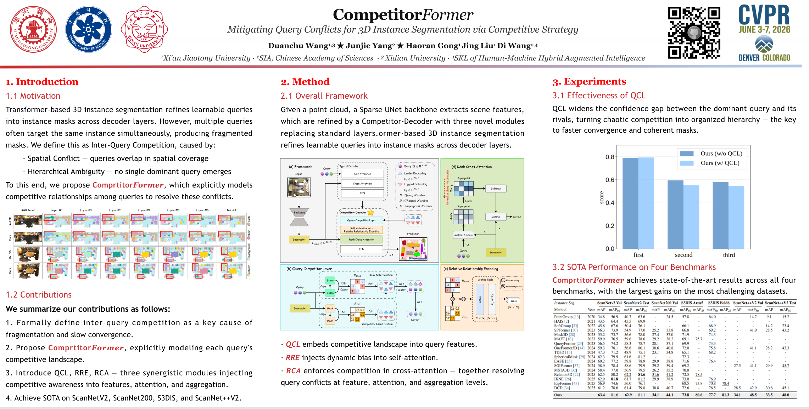

# CompetitorFormer

> **CompetitorFormer: Mitigating Query Conflicts for 3D Instance Segmentation via Competitive Strategy (CVPR 2026)**
>
> Duanchu Wang, Junjie Yang, Haoran Gong, Jing Liu, Di Wang

This repository is the official implementation of CompetitorFormer, a competitive-strategy-based transformer that mitigates query conflicts for 3D instance segmentation.

<p align="center">
  
</p>

---

## 📋 Table of Contents

- [Installation](#-installation)
- [Data Preparation](#-data-preparation)
- [Training](#-training)
- [Evaluation](#-evaluation)
- [Results & Models](#-results--models)
- [Citation](#-citation)
- [Acknowledgements](#-acknowledgements)

---

## 🛠️ Installation

### Requirements

- Python 3.8
- PyTorch 1.13.1
- CUDA 11.7
- Ubuntu 22.04 LTS

### Setup Environment

```bash
# Create conda environment
conda create -n competitorformer python=3.8 -y
conda activate competitorformer

# Install PyTorch and torchvision
pip install torch==1.13.1+cu117 torchvision==0.14.1+cu117 torchaudio==0.13.1 --extra-index-url https://download.pytorch.org/whl/cu117

# Install spconv
pip install spconv-cu117

# Install torch-scatter
pip install torch-scatter==2.1.0 -f https://data.pyg.org/whl/torch-1.13.0+cu117.html

# Install segmentator (custom CUDA/C++ ops)
git clone https://github.com/Karbo123/segmentator.git
cd segmentator/csrc
mkdir build && cd build

cmake .. \
    -DCMAKE_PREFIX_PATH=`python -c 'import torch;print(torch.utils.cmake_prefix_path)'` \
    -DPYTHON_INCLUDE_DIR=$(python -c "from distutils.sysconfig import get_python_inc; print(get_python_inc())") \
    -DPYTHON_LIBRARY=$(python -c "import distutils.sysconfig as sysconfig; print(sysconfig.get_config_var('LIBDIR'))") \
    -DCMAKE_INSTALL_PREFIX=`python -c 'from distutils.sysconfig import get_python_lib; print(get_python_lib())'`

make && make install
cd ../../..

# Install CompetitorFormer and other dependencies
pip install -r requirements.txt

# install CompetitorFormer
python3 setup.py develop
```

> **Tip:** If you encounter errors when building `segmentator`, please double check that:
> - The active conda environment's `python` is the one being used by `cmake` (run `which python` to verify).
> - Your CUDA toolkit version (e.g., `nvcc --version`) matches the CUDA runtime used by PyTorch (11.7).

---

## 📦 Data Preparation

### ScanNet v2

(1) Download the ScanNet v2 dataset.

(2) Put the data in the corresponding folders.

- Copy the files `[scene_id]_vh_clean_2.ply`, `[scene_id]_vh_clean_2.labels.ply`, `[scene_id]_vh_clean_2.0.010000.segs.json` and `[scene_id].aggregation.json` into the `scannetv2/scans` (train/val scenes) and `scannetv2/scans_test` (test scenes) folders.
- Put the file `scannetv2-labels.combined.tsv` in the `scannetv2/` folder.

The dataset files are organized as follows.

```
CompetitorFormer
├── data
│   ├── scannetv2
│   │   ├── scans                                    # train + val scenes
│   │   │   ├── scene0000_00
│   │   │   │   ├── scene0000_00_vh_clean_2.ply
│   │   │   │   ├── scene0000_00_vh_clean_2.labels.ply
│   │   │   │   ├── scene0000_00_vh_clean_2.0.010000.segs.json
│   │   │   │   └── scene0000_00.aggregation.json
│   │   │   ├── ...
│   │   ├── scans_test                               # test scenes
│   │   │   ├── scene0707_00
│   │   │   │   └── scene0707_00_vh_clean_2.ply
│   │   │   ├── ...
│   │   ├── scannetv2-labels.combined.tsv
│   │   ├── scannetv2_train.txt
│   │   ├── scannetv2_val.txt
│   │   ├── scannetv2_test.txt
```

(3) Generate shared superpoints and input files `[scene_id]_inst_nostuff.pth` for instance segmentation. The script `prepare_data.sh` runs both steps: it first computes shared superpoints with `segmentator`, then preprocesses every scene into `(coords, colors, normals, sem_labels, instance_labels)` and writes them into `train/`/`val/`/`test/`. Evaluation GT txt files for val scenes are also generated.

```bash
cd data/scannetv2

# Edit the dataset / output paths in prepare_data.sh to match your machine first
bash prepare_data.sh \
  --dataset_root       /path/to/scannetv2/scans \
  --dataset_root_test  /path/to/scannetv2/scans_test \
  --output_root        /path/to/scannetv2_output
```

> Note: `prepare_superpoint.py` relies on the `segmentator` library built during [Installation](#-installation). Make sure it is installed before running this step.

### ScanNet 200

ScanNet 200 reuses the train/val scenes from `scannetv2/scans` and shares the test set and superpoints with ScanNet v2, so please prepare ScanNet v2 first.

(1) Preprocess the 200-class train/val scenes:

```bash
cd data/scannet200

# Edit the dataset / output paths in prepare_data.sh to match your machine first
bash prepare_data.sh
```

This runs `preprocess_scannet200.py` to generate `{scene_id}_inst_nostuff.pth` (200 normalized class ids + instance ids) under `train/` and `val/`, then symlinks the shared `test/` and `superpoints/` from the ScanNet v2 output directory (`${SCNNETV2_OUTPUT}` inside the script).

The preprocessed dataset files are organized as follows.

```
CompetitorFormer
├── data
│   ├── scannet200
│   │   ├── train
│   │   │   ├── scene0000_00_inst_nostuff.pth
│   │   │   ├── ...
│   │   ├── val
│   │   │   ├── scene0000_00_inst_nostuff.pth
│   │   │   ├── ...
│   │   ├── test            -> symlink to scannetv2_output/test
│   │   ├── superpoints     -> symlink to scannetv2_output/superpoints
```

### ScanNet++

ScanNet++ instance segmentation uses **84 thing classes** (mapped from the official 100-class semantic labels). The loader type is `scannetpp` and does **not** apply the ScanNet v2 `label-2` remap.

(1) Download the official ScanNet++ dataset from [ScanNet++](https://kaldir.vc.in.tum.de/scannetpp/) (meshes, segments, and metadata).

(2) Use the official validation split `splits/nvs_sem_val.txt` (**50 scenes**). A copy is provided at `data/scannetpp/nvs_sem_val.txt`.

(3) Preprocess each val scene into Pointcept / LaSSM-style per-scene `.npy` folders. From `mesh_aligned_0.05.ply` (+ `segments.json` / `segments_anno.json` for labels):

- compute vertex **normals** from the mesh (`input_channel: 9` requires them)
- compute **superpoints** with `segmentator` (same library as in [Installation](#-installation))
- write the files below under `data/scannetpp/val_vtx/<scene_id>/`

```
CompetitorFormer
├── data
│   ├── scannetpp
│   │   ├── nvs_sem_val.txt                          # official 50-scene val split
│   │   ├── val_vtx                                  # processed val (needed for eval)
│   │   │   ├── 09c1414f1b
│   │   │   │   ├── coord.npy
│   │   │   │   ├── color.npy                        # uint8 RGB; loader does rgb/127.5-1
│   │   │   │   ├── normal.npy
│   │   │   │   ├── superpoint.npy
│   │   │   │   ├── segment.npy                      # semantic ids (or semantic_label.npy)
│   │   │   │   └── instance.npy                     # instance ids (or instance_label.npy)
│   │   │   ├── ...
```

The `scannetpp` loader globs scene directories under `data_root/prefix` (`data/scannetpp` + `val_vtx` in the default config). **`--eval_only` does not load the train set**, so `train_grid1mm_chunk6x6_stride3x3` is not required for validation.

---

## 🚀 Training

> TODO: Add training commands, e.g.
>
> ```bash
> python tools/train.py --config-file configs/scannet/competitorformer_scannet.yaml
> ```

---

## 📊 Evaluation

### ScanNet++

Prerequisites: conda env `competitorformer`, `PYTHONPATH` pointing at the repo root, and the processed `val_vtx` npy scenes above. No train set is needed.

1. Download the official val checkpoint `epoch490_AP_0.3335_0.4725_0.5640.pth` (~281MB) and place it at `checkpoints/epoch490_AP_0.3335_0.4725_0.5640.pth`.

   > **TODO:** replace with the HuggingFace or ModelScope URL, e.g. `https://huggingface.co/<org>/CompetitorFormer/resolve/main/epoch490_AP_0.3335_0.4725_0.5640.pth`

2. Run eval-only (skips the train loader):

```bash
conda activate competitorformer
export PYTHONPATH=$PWD:$PYTHONPATH

python tools/train.py configs/scannetpp/competitorformer_scannetpp.yaml \
  --work_dir exps/competitorformer_scannetpp \
  --eval_only \
  --resume checkpoints/epoch490_AP_0.3335_0.4725_0.5640.pth
```

Inference knobs in `configs/scannetpp/competitorformer_scannetpp.yaml` (do not reuse ScanNet v2 values):

- `model.decoder.num_query`: **500** (ScanNet v2 uses 400)
- `model.test_cfg.topk_insts`: **1300**
- `model.num_class`: **84**
- `data.val.prefix`: `val_vtx`

`predict_by_feat` is OOM-safe on large PP scenes (filter on superpoints first). You can override `data_root` in the yaml if your processed npy live elsewhere; no machine-specific `/u01/...` paths are required.

---

## 🏆 Results & Models

### ScanNet++ (official 50-scene val)

Fair val checkpoint: `epoch490_AP_0.3335_0.4725_0.5640.pth` (`num_query=500`).

| Source | AP | AP<sub>50</sub> | AP<sub>25</sub> | Notes |
| --- | ---: | ---: | ---: | --- |
| Checkpoint filename | 0.3335 | 0.4725 | 0.5640 | Saved during training |
| Original training logs | 0.333 | 0.475 | 0.569 | Same weight, original val run |
| Re-eval (this repo) | 0.339 | 0.485 | 0.581 | Official 50-scene `val_vtx` npy; superpoints recomputed |

The small gap vs. the filename / original logs is expected when superpoints and preprocessing are regenerated.

Trainval-only checkpoints (e.g. `epoch498_AP_0.6121_0.8173_0.8938.pth`) are **not** comparable to this val split and are not used as the official number.

> **TODO:** HuggingFace / ModelScope download URL for `epoch490_AP_0.3335_0.4725_0.5640.pth`.

---

## 📝 Citation

If you find this work useful, please consider citing:

```bibtex
@InProceedings{Wang_2026_CVPR,
  title     = {CompetitorFormer: Mitigating Query Conflicts for 3D Instance Segmentation via Competitive Strategy},
  author    = {Wang, Duanchu and Yang, Junjie and Gong, Haoran and Liu, Jing and Wang, Di},
  booktitle = {Proceedings of the IEEE/CVF Conference on Computer Vision and Pattern Recognition (CVPR)},
  pages     = {34724-34733},
  year      = {2026},
}
```

---

## 🙏 Acknowledgements

This project builds upon several excellent open-source repositories. We thank the authors of:

- [Segmentator](https://github.com/Karbo123/segmentator)
- [PyTorch](https://github.com/pytorch/pytorch)
- [spconv](https://github.com/traveller59/spconv)

---

## 📄 License

This project is released under the [MIT License](LICENSE).
